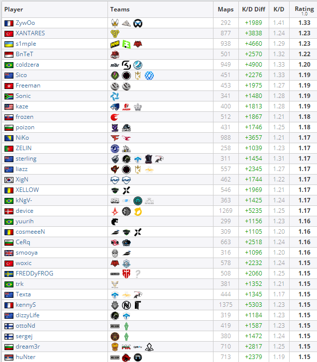
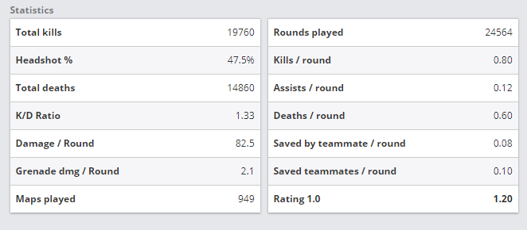
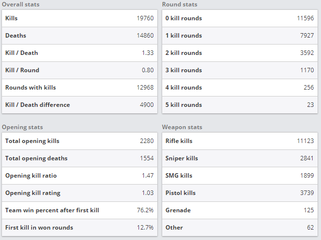
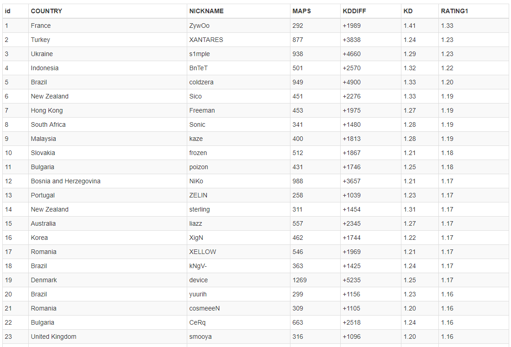

# Web Scraper for hltv.org

## Scrapes all player stats from https://www.hltv.org/stats/players
 * **615** players             (**6** column)
 
 
 * **615** stats               (**14** columns)
 
 
 * **615** individual stats    (**24** columns)
 
 
 
 615x6 + 615x14 + 615x24 = 3690 + 8610 + 14760 = **27060 RECORDS**
 
 
